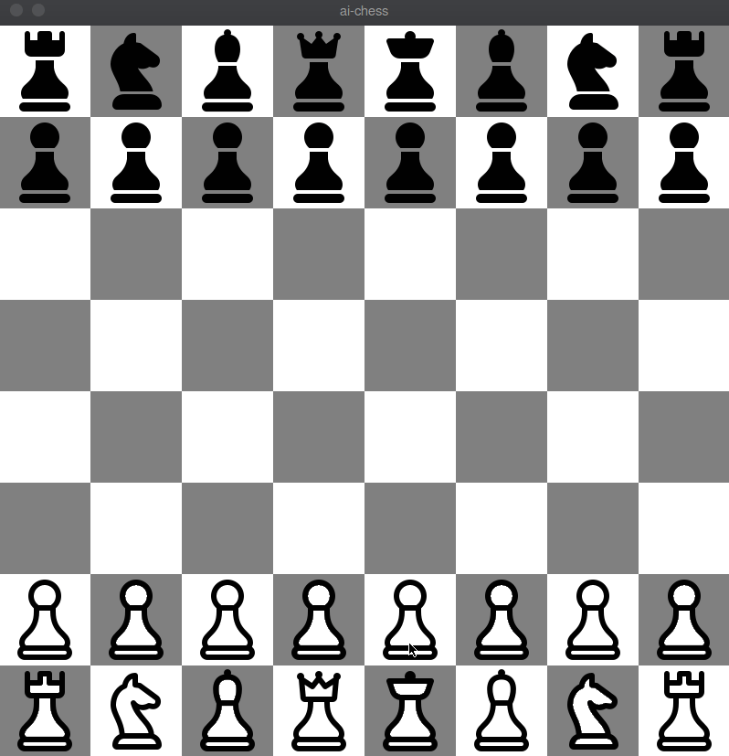

# ai-chess
 

AI-Chess is a platform to make chess artificial intelligences compete to themselves.
You can play with them either.

The main objective of the project is read scripts of chess artificial intelligences and execute them against eachother.
With this platform we can will be able to find the best chess artificial intelligences.
You can use it to learn chess, it's basic rules and how to create an artificial intelligence with good performance.



## Install

The following steps covers the setup process

### Using pyenv with pyenv-virtualenv

You also should use virtualenv to build/develop the project and I recommend the use of [pyenv](https://github.com/pyenv/pyenv) with [pyenv-virtualenv](https://github.com/pyenv/pyenv-virtualenv) to manage multiple python environments.

```bash
pyenv install 3.7.5
pyenv virtualenv 3.7.5 ai-chess
pyenv activate ai-chess
```

If you have any problems installing pyenv try [these common solutions](https://github.com/pyenv/pyenv/wiki/Common-build-problems).

### Installing dependencies (Python 3.7.5)

Open your bash and run the follow command to install all the project dependencies, you just need to run the command one time

```bash
(PINP) $ python -m pip install -r requirements.txt
```
